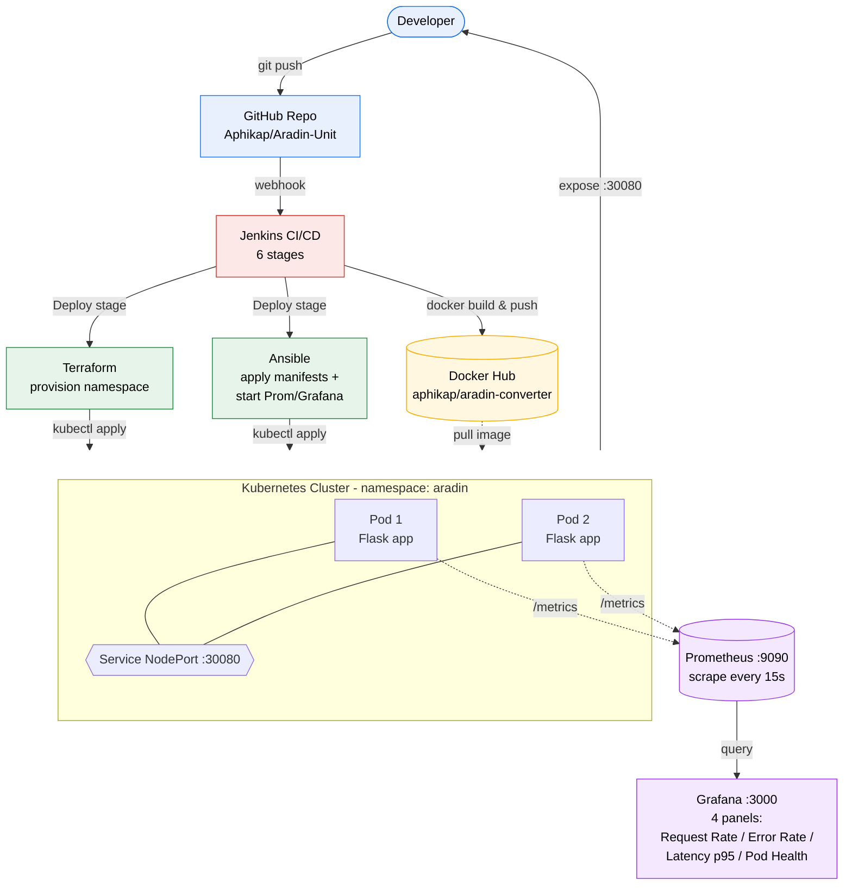

# 🚀 [Aradin Unit] — ENG23 3074

ระบบ API แปลงหน่วย Aradin Converter สร้างด้วย Python Flask จัดการคอนเทนเนอร์ด้วย Docker และ deploy ขึ้น Kubernetes ผ่าน Jenkins pipeline พร้อมเตรียม Infrastructure ด้วย Terraform และ Ansible แบบอัตโนมัติ

---

## 👥 สมาชิกในกลุ่ม

| รหัสนักศึกษา | ชื่อ-นามสกุล | ความรับผิดชอบ |
|-------------|-------------|---------------|
| B6626259 | ชื่อ นายณภัทร ศรีสุจันทร์  | Git, App Development |
| B6615994 | ชื่อ นามธนภัทร เย็นสวัสดิ์ | Jenkins, Docker |
| B6628611 | ชื่อ นายอภิชาติ บรรพตะธิ | Terraform, Ansible |
| B6628857 | ชื่อ นายอาระดิน สีสุระ | Kubernetes, Monitoring |

---

## 📌 ภาพรวมโปรเจค

### แอปพลิเคชัน
- **ชื่อ:** [Aradin Converter ]
- **ประเภท:** [Web Application & REST API]
- **ภาษา / Framework:** [Python Flask (Backend) + HTML/CSS/JS (Frontend)]
- **คำอธิบาย:** [Aradin Converter เป็นระบบแปลงหน่วยวัด (เช่น ความยาว น้ำหนัก อุณหภูมิ) แบบครบวงจร ระบบนี้มีหน้า Web Application ให้ผู้ใช้งานทั่วไปสามารถกรอกข้อมูลและดูผลลัพธ์ผ่านเบราว์เซอร์ได้อย่างง่ายดาย พร้อมทั้งมีระบบ REST API หลังบ้านที่เปิดให้นักพัฒนาหรือแอปพลิเคชันอื่นสามารถเชื่อมต่อเพื่อดึงฟังก์ชันคำนวณไปใช้งานต่อยอดได้]

### Architecture Diagram



<details>
<summary>📜 ASCII diagram (สำหรับดูใน terminal)</summary>

```
Developer ──git push──▶ GitHub ──webhook──▶ Jenkins (6 stages)
                                                │
                                                ▼
                                          Docker Hub ◀─── docker push
                                                │
                                       ┌────────┴────────┐
                                       ▼                 ▼
                                  Terraform           Ansible
                                  (namespace)    (manifests + Prom/Grafana)
                                       │                 │
                                       └────────┬────────┘
                                                ▼
                              ┌─── Kubernetes Cluster (ns: aradin) ───┐
                              │   Pod 1 [App]   Pod 2 [App]           │
                              │       └─── Service NodePort :30080 ───┤
                              └────────────────┬──────────────────────┘
                                               │
                              Prometheus :9090 ◀── scrape /metrics every 15s
                                       │
                                       ▼
                              Grafana :3000 (4 panels)
```

</details>

---

## 📁 โครงสร้าง Repository

```
[aradin-converter]/
├── app/
│   ├── templates/
│   │   └── index.html          # หน้าเว็บสำหรับให้ผู้ใช้กรอกข้อมูล (Frontend Web App)
│   ├── static/
│   │   └── style.css           # ไฟล์ตกแต่งหน้าเว็บให้สวยงาม
│   ├── app.py                  # โค้ดหลักประมวลผล (Backend API และเสิร์ฟหน้าเว็บ)
│   ├── requirements.txt        # Python dependencies
│   └── Dockerfile              # คำสั่งสร้าง Docker image
├── Jenkinsfile                 # กำหนด CI/CD pipeline ทุก stage
├── terraform/
│   ├── main.tf                 # กำหนด resource ที่จะ provision
│   ├── variables.tf            # ตัวแปร input
│   └── outputs.tf              # ค่า output หลัง apply
├── ansible/
│   ├── inventory               # รายชื่อ host เป้าหมาย
│   └── playbook.yml            # tasks สำหรับ configure environment
├── k8s/
│   ├── deployment.yaml         # กำหนด Pods และ replicas
│   └── service.yaml            # เปิดพอร์ตให้เข้าถึงแอปจากภายนอก
├── monitoring/
│   ├── prometheus.yml          # ตั้งค่า scrape target
│   └── grafana-dashboard.json  # Dashboard ที่ export จาก Grafana
└── README.md
```

---

## ⚙️ สิ่งที่ต้องติดตั้งก่อน (Prerequisites)

ตรวจสอบให้แน่ใจว่าติดตั้งทุก tool ครบก่อนรันโปรเจค

| Tool | Version | หน้าที่ |
|------|---------|---------|
| Git | ≥ 2.x | จัดการ source code |
| Docker | ≥ 24.x | สร้างและรัน container |
| Jenkins | ≥ 2.4xx | ระบบ CI/CD automation |
| Terraform | ≥ 1.x | Provision infrastructure |
| Ansible | ≥ 2.15 | Configure environment |
| kubectl | ≥ 1.28 | สั่งงาน Kubernetes cluster |
| Minikube / K3s | latest | Kubernetes แบบ local |
| Prometheus | ≥ 2.x | เก็บ metrics |
| Grafana | ≥ 10.x | แสดง dashboard |

---

## 🏃 วิธีรันโปรเจค (Quick Start)

### 1. Clone Repository
```bash
git clone https://github.com/[username]/[project-name].git
cd [project-name]
```

### 2. รันแอปบนเครื่องโดยตรง (ไม่ผ่าน pipeline)
```bash
cd app
pip install -r requirements.txt
python app.py
# แอปรันที่ http://localhost:5000
```

### 3. Build และรันด้วย Docker
```bash
docker build -t [username]/[app-name]:latest ./app
docker run -p 5000:5000 [username]/[app-name]:latest
```

---

## 🔄 CI/CD Pipeline (Jenkins)

### ลำดับการทำงานของ Pipeline

```
Checkout ──▶ Build ──▶ Test ──▶ Docker Build ──▶ Push to Hub ──▶ Deploy
```

| Stage | คำอธิบาย |
|-------|----------|
| **Checkout** | ดึงโค้ดล่าสุดจาก GitHub |
| **Build** | ติดตั้ง dependencies |
| **Test** | รัน unit test |
| **Docker Build** | สร้าง Docker image |
| **Push to Hub** | อัปโหลด image ขึ้น Docker Hub |
| **Deploy** | รัน Terraform + Ansible แล้ว apply Kubernetes manifests |

### วิธีตั้งค่า Jenkins
1. ติดตั้ง Jenkins และเปิดที่ `http://localhost:8080`
2. ติดตั้ง plugin: **Git**, **Pipeline**, **Docker Pipeline**
3. เพิ่ม credentials สำหรับ Docker Hub (ชื่อ `dockerhub-credentials`)
4. สร้าง Pipeline job ใหม่ และชี้ไปที่ repository นี้
5. ตั้งค่า Webhook ใน GitHub:
   - ไปที่ **Settings → Webhooks → Add webhook**
   - Payload URL: `http://[jenkins-host]:8080/github-webhook/`
   - Content type: `application/json`
   - ติ๊ก trigger: **Just the push event**

---

## 🏗️ Infrastructure as Code

### Terraform — Provision Infrastructure
```bash
cd terraform
terraform init      # ดาวน์โหลด provider plugins
terraform plan      # ตรวจสอบว่าจะสร้างอะไรบ้าง
terraform apply     # สร้าง resource จริง
```
> **สิ่งที่ Terraform สร้าง:** [อธิบาย เช่น Docker network, Kubernetes namespace, local directory]

### Ansible — Configure Environment
```bash
cd ansible
ansible-playbook -i inventory playbook.yml
```
> **สิ่งที่ Ansible ทำ:** [อธิบาย เช่น ติดตั้ง kubectl, copy kubeconfig, ตั้งค่า environment variable]

> ⚠️ **หมายเหตุ:** ใน pipeline จริง Jenkins จะเรียก Terraform และ Ansible อัตโนมัติในขั้นตอน Deploy ไม่ต้องรันด้วยมือ

---

## ☸️ Kubernetes Deployment

### Apply Manifests ด้วยตัวเอง
```bash
kubectl apply -f k8s/deployment.yaml
kubectl apply -f k8s/service.yaml
```

### ตรวจสอบสถานะ
```bash
kubectl get pods -n [namespace]
kubectl get svc  -n [namespace]
```

### ผลลัพธ์ที่ควรจะได้
```
NAME                        READY   STATUS    RESTARTS   AGE
[app-name]-xxxxxxxxx-xxxxx  1/1     Running   0          2m
[app-name]-xxxxxxxxx-yyyyy  1/1     Running   0          2m

NAME            TYPE       CLUSTER-IP     PORT(S)          AGE
[app-name]-svc  NodePort   10.96.xx.xxx   5000:30080/TCP   2m
```

### เข้าถึงแอปพลิเคชัน
```
http://localhost:30080
```

---

## 📊 Monitoring

### Prometheus — เก็บ Metrics
- ไฟล์ config: `monitoring/prometheus.yml`
- Scrape ทุก **15 วินาที**
- Target endpoint: `http://[app-host]:[port]/metrics`

รัน Prometheus:
```bash
prometheus --config.file=monitoring/prometheus.yml
# เปิด UI ที่ http://localhost:9090
```

### Grafana — แสดง Dashboard
- ไฟล์ dashboard: `monitoring/grafana-dashboard.json`
- Data source: Prometheus (`http://localhost:9090`)

วิธี import dashboard:
1. เปิด Grafana ที่ `http://localhost:3000`
2. ไปที่ **Dashboards → Import**
3. อัปโหลดไฟล์ `grafana-dashboard.json`

### Panels ใน Dashboard

| Panel | Metric (PromQL) | แสดงข้อมูลอะไร |
|-------|-----------------|----------------|
| Request Rate | `rate(http_requests_total[1m])` | จำนวน request ต่อวินาที |
| Error Rate | `rate(http_requests_total{status=~"5.."}[1m])` | จำนวน error 5xx ต่อวินาที |
| Latency (p95) | `histogram_quantile(0.95, ...)` | response time ที่ percentile 95 |
| Pod Health | `up{job="[app-name]"}` | service ขึ้นหรือล่ม (1/0) |

---

## 🌿 Branching Strategy

```
main        ──── โค้ดที่พร้อม production, protected branch
dev         ──── รวมโค้ดก่อน merge ขึ้น main
feature/*   ──── พัฒนา feature แต่ละอัน (เช่น feature/add-login)
```

| Branch | Protected | คำอธิบาย |
|--------|-----------|----------|
| `main` | ✅ | trigger pipeline อัตโนมัติเมื่อ merge |
| `dev` | ✅ | ทดสอบก่อน merge ขึ้น main |
| `feature/*` | ❌ | พัฒนาแยกกันแล้วค่อย merge เข้า dev |

---

## 🧪 API Endpoints

| Method | Endpoint | คำอธิบาย |
|--------|----------|----------|
| `GET` | `/` | Health check — ตรวจว่าแอปยังรันอยู่ |
| `GET` | `/metrics` | Prometheus metrics endpoint |
| `GET` | `/[resource]` | [อธิบาย] |
| `POST` | `/[resource]` | [อธิบาย] |
| `DELETE` | `/[resource]/:id` | [อธิบาย] |

---

## 🐛 ปัญหาที่พบบ่อย (Troubleshooting)

**Pods ค้างอยู่ที่ `Pending` ไม่ยอม Running**
```bash
kubectl describe pod [pod-name] -n [namespace]
# ดูที่ Events: อาจเกิดจาก resource ไม่พอ หรือ image pull error
```

**Jenkins pipeline ล้มเหลวตอน Docker Build**
```bash
# ตรวจว่า Docker daemon รันอยู่
sudo systemctl start docker
# เพิ่ม jenkins user เข้า docker group
sudo usermod -aG docker jenkins
```

**Prometheus แสดง target เป็น DOWN**
```bash
# ตรวจว่าแอปเปิด /metrics ได้จริง
curl http://localhost:5000/metrics
# ตรวจ prometheus.yml ว่า host:port ตรงกับแอปจริง
```

---

## 📚 เอกสารอ้างอิง

- [Jenkinsfile Declarative Pipeline Syntax](https://www.jenkins.io/doc/book/pipeline/syntax/)
- [Terraform Documentation](https://developer.hashicorp.com/terraform/docs)
- [Ansible Documentation](https://docs.ansible.com/)
- [Kubernetes Documentation](https://kubernetes.io/docs/)
- [Prometheus Documentation](https://prometheus.io/docs/)
- [Grafana Documentation](https://grafana.com/docs/)
- [Markdown Guide](https://www.markdownguide.org/)
- [GitHub Markdown Syntax](https://docs.github.com/en/get-started/writing-on-github/getting-started-with-writing-and-formatting-on-github/basic-writing-and-formatting-syntax)

